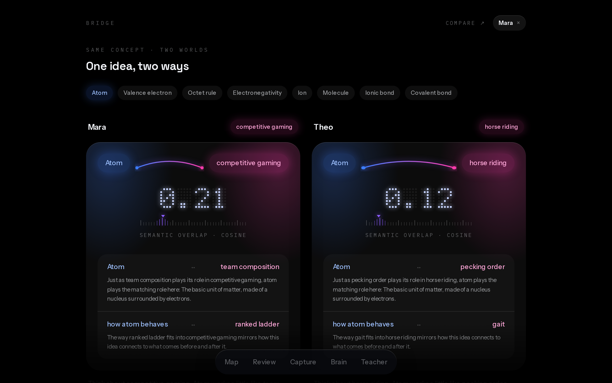
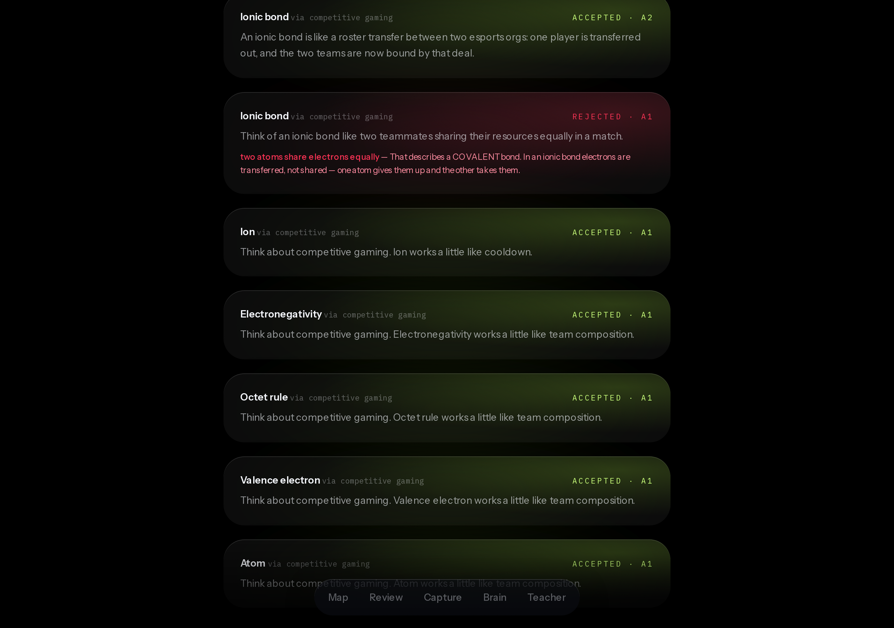
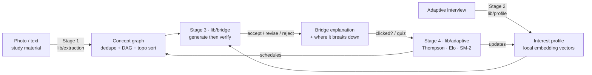
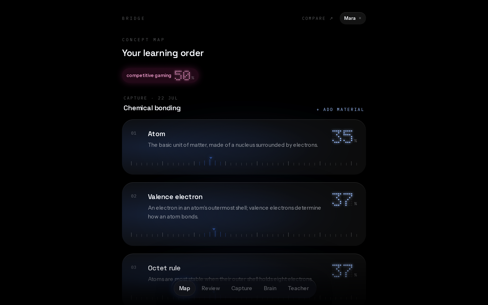
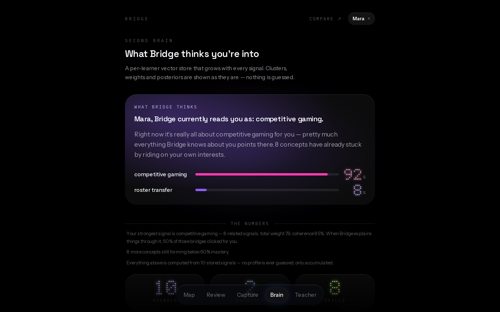

<h1 align="center">Bridge</h1>

<p align="center"><strong>Learn new material through the knowledge you already hold.</strong></p>

<p align="center">
  <a href="https://bridge-livid-one.vercel.app"><b>▶ Live demo</b></a> — no sign-up, no API key needed ·
  open the lived-in profiles <code>Mara</code> or <code>Theo</code>, or sign in with any name
</p>

---

A chemistry teacher explains ionic bonds. One student — the one who spends every evening in
ranked matches — hears nothing but noise. Tell *that* student an ionic bond works like a roster
transfer between two esports orgs — one player handed over, two teams bound by the deal — and it
clicks instantly. Great teachers improvise these bridges for one classroom. **Bridge builds them
automatically, for every learner, from whatever they already love — and fact-checks every single
one before it reaches the student.**

<p align="center">
  
  <br><em>One idea, two ways: the same chemistry chapter, re-expressed per learner — same facts, same vocabulary, same assessment.</em>
</p>

The mechanism is **prior-knowledge anchoring / analogical transfer**, a real and well-supported
effect — not "learning styles," which is discredited. Analogies are used only for *explanation*;
all *assessment* stays in the subject's own vocabulary, so a student can never end up learning
the analogy instead of the subject.

## The part we're proudest of: it rejects its own analogies

Every generated bridge is fact-checked by a second, independent model call against the source
material. A wrong analogy is worse than no analogy — so when verification fails, Bridge retries
with the contradictions fed back, and falls back to a plain explanation rather than shipping
something false. **Every attempt is kept, including the rejected ones.** The Verification tab
shows the system catching its own mistake:

<p align="center">
  
  <br><em>Attempt 1 claimed ionic bonds "share electrons equally" — that's a covalent bond. Rejected, corrected, re-verified, accepted.</em>
</p>

Honesty is a design principle throughout: similarity scores are shown as raw cosine values (even
when they're unflatteringly low), the learner profile displays only what was actually inferred
and why, and the teacher view receives aggregates only.

## The four AI/ML stages



1. **`lib/extraction` — Vision → Concept Graph.** The model returns structured concepts (label,
   definition, verbatim source quote, difficulty, prerequisites). *Our own code* then embeds them
   locally, merges near-duplicates by cosine similarity, builds the prerequisite DAG, detects
   cycles, and topologically sorts them into a learning order.
2. **`lib/profile` + `lib/onboarding` — Interest profile via adaptive interview.** Onboarding is
   a server-driven interview, not a form: free seeds → LLM-generated drill questions → a **word
   magnet** per domain that mixes real terms in three tiers with plausible decoys. What the
   learner actually recognizes determines a *verified* vocabulary depth (`novice/hobbyist/deep`)
   — confidence is **earned, not self-reported**, and larping collapses on the decoys. The result
   is a **vector store** of interest domains (local embeddings), not a prompt string.
3. **`lib/bridge` — Bridge engine + verification loop.** One call generates the analogical
   explanation; a second, independent call fact-checks it against the source quote. On
   `revise`/`reject` it retries with the contradictions fed back, then falls back to a plain
   explanation. Every attempt is logged (see above).
4. **`lib/adaptive` — the real ML, our own code.** Thompson sampling picks which interest domain
   to use; Elo tracks per-concept mastery; SM-2-lite schedules spaced review — all unit-tested:

   - **Thompson sampling** — each domain holds a Beta(α, β) posterior over "did this analogy
     work?"; sample `θ_d ~ Beta(α_d, β_d)`, pick the max; *clicked* → `α+1`, *didn't land* → `β+1`.
   - **Elo mastery** — `E = 1 / (1 + 10^((R_C − R_L)/400))`, `R_L ← R_L + K·(S − E)` with `K ≈ 24`.
   - **SM-2-lite** — intervals grow `1 → 6 → interval·EF` days,
     `EF ← max(1.3, EF + (0.1 − (5−q)·(0.08 + (5−q)·0.02)))`; a miss resets to 1.

5. **`lib/brain` — a second brain per learner.** Every signal lands in a per-learner vector
   store; near-duplicate signals (cosine ≥ 0.92) strengthen an item's weight instead of
   inserting, so repeated signals mature into strong interests. The Brain tab renders the store
   as a skill tree — greedy weighted clustering over the stored vectors, our own unit-tested
   code, no LLM involved — with a transparent summary where every claim is backed by a weight, a
   posterior, or a mastery score.

<p align="center">
  
  
  <br><em>Left: the prerequisite-sorted learning order with live mastery. Right: what Bridge thinks you're into — nothing is guessed, everything is accounted for.</em>
</p>

## Judging criteria, mapped

| Criterion | Where it lives in Bridge |
|---|---|
| **Educational Impact** | Personalization grounded in evidence (prior-knowledge anchoring, *not* learning-styles); assessment never drifts into the analogy (anti-cheat guardrail); spaced repetition + mastery tracking close the loop; teacher view (aggregates only) makes it classroom-usable. |
| **Creative Use of AI/ML** | AI checks AI: independent generate→verify loop with visible rejections; interview-style onboarding with decoy-based vocabulary probes; hybrid design — LLM for language, *our own* embedding/graph/bandit/Elo/SM-2 code for everything measurable. |
| **Technical Execution** | Four stages working end to end; unit tests on the math (dedupe, cycle detection, Thompson, Elo, SM-2, clustering — `npm test`); TS strict; structured-JSON LLM layer; local embeddings (no second API dependency); [`DECISIONS.md`](./DECISIONS.md) documents every trade-off. |
| **Pitch / Demo** | [Live deployment](https://bridge-livid-one.vercel.app) with zero-friction sign-in and seeded, explorable profiles; the money shot (reject→accept) is reproducible in the Verification tab in under a minute. |

## Run it (4 commands from a fresh clone)

```bash
cp .env.example .env      # add your OpenRouter key for live AI
npm install
npx prisma migrate dev
npm run dev
```

Then seed two demo learners (competitive gaming vs horse riding) with pre-generated bridges:

```bash
npm run db:seed
```

Open http://localhost:3000 and sign in with any name. The seeded profiles `Mara` and `Theo`
are fully explorable **without an API key** — the embedding, dedupe, graph, Thompson, Elo, SM-2
and brain-clustering math all run for real. Live AI (capturing your own material, generating
fresh bridges) needs `OPENROUTER_API_KEY` in `.env`. Models are routed per task: learner-facing
text runs on `google/gemini-2.5-flash-lite` (picked for latency — the learner waits on these
screens), document scans on `qwen/qwen3-vl-32b-instruct` (the OCR specialist), and any call that
is rate-limited, times out or comes back malformed is retried on `google/gemini-3.1-flash-lite`.
All three are env vars, so swapping providers costs one line.

```bash
npm test                  # unit tests: dedupe, cycle detection, Thompson, Elo, SM-2, clustering
```

## Privacy

A learner is a local profile — a name and (on anything hosted) a password, never an email.
Session cookies are HMAC-signed when `AUTH_SECRET` is set, so a session cannot be forged from a
known profile id. Learner data, including the second brain, stays in the local database and is
never shared between learners; the public showcase pages (`/compare`, `/teacher`) only ever read
the two seeded demo profiles and cohort-level aggregates. The teacher view receives
**aggregates only**: concept-level counts, never individuals, never interest profiles. Onboarding
asks only about interests — never family, emotions, or health.

## Stack

Next.js 16 (App Router, TS strict) · Tailwind v4 · SQLite + Prisma 6 · OpenRouter (structured JSON)
· local `@xenova/transformers` embeddings (`all-MiniLM-L6-v2`) · PWA (installable).

<details>
<summary><b>Deploy</b> — persistent host or Vercel public-demo mode</summary>

Two supported targets, same codebase:

- **Persistent host (Railway / Fly.io / your own box)** — SQLite on a persistent volume, the
  full app with no demo restrictions.
- **Vercel (public demo)** — the [live demo](https://bridge-livid-one.vercel.app). On Vercel the
  app enters public-demo mode automatically: username + password sign-in, a small AI budget per
  profile (default 5 *learning aspects* — capture and onboarding are free, and everything you do
  on one concept is covered by its single unit), and the "no private data" notice. Set
  `AUTH_SECRET` (any long random string) so session cookies are signed, and `OWNER_UNLOCK_CODE`
  if you want an account of your own without the budget. The embedding model runs inside the function (linux-x64 ONNX only, cache in
  `/tmp`). Set `OPENROUTER_API_KEY` in the Vercel project for live AI, and point
  `TURSO_DATABASE_URL`/`TURSO_AUTH_TOKEN` at a (free-tier) Turso database so profiles persist —
  Turso is hosted SQLite, so the schema and every query stay identical. Without Turso the app
  falls back to an ephemeral `/tmp` copy of the seeded DB. Apply the schema once with
  `node scripts/migrate-remote.mjs`, seed with `npx prisma db seed` (both honor the Turso env
  vars). `GET /api/me` reports which datasource is live and whether it is reachable (never the
  secrets themselves), which makes a misconfigured deployment diagnosable from outside.

</details>

## What's not built yet (honest status)

- **Live vision** is wired end to end (camera + client downscale + `images[]` API), but the
  bundled demo data is text-sourced; scanning a real handwritten page needs a live API key.
- The concept map is a linear, prerequisite-ordered timeline rather than a free-form 2-D graph.
- No PNG icon rasterization (the PWA ships a single maskable SVG icon).

See [`DECISIONS.md`](./DECISIONS.md) for the reasoning behind each technical choice.

MIT licensed.
